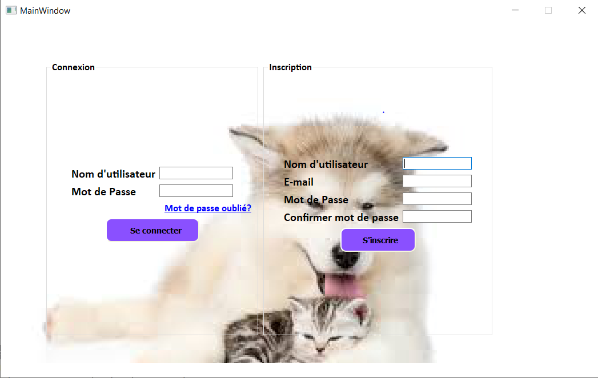
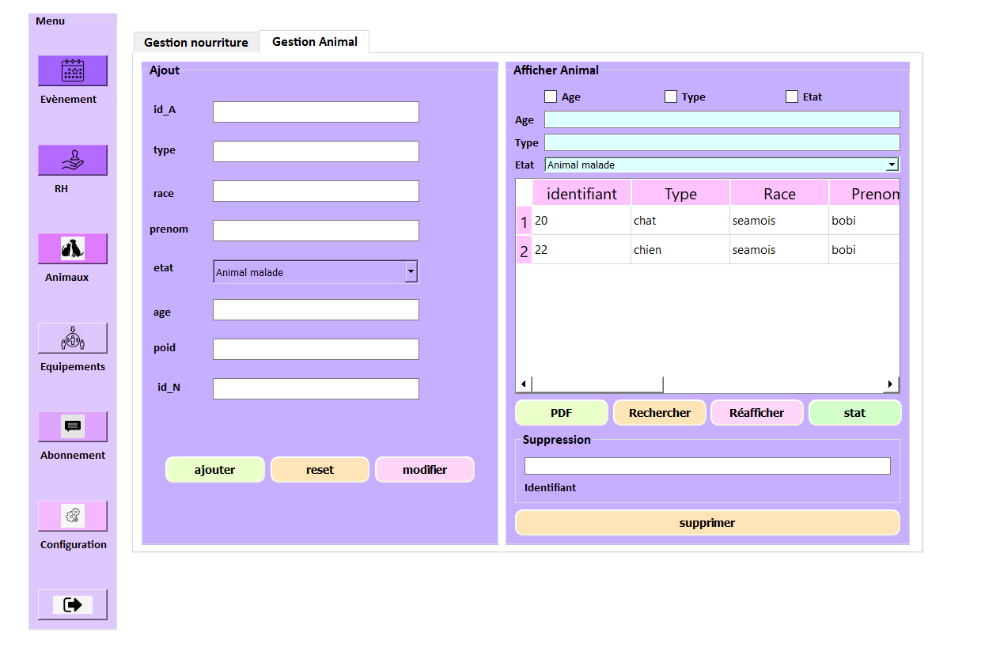
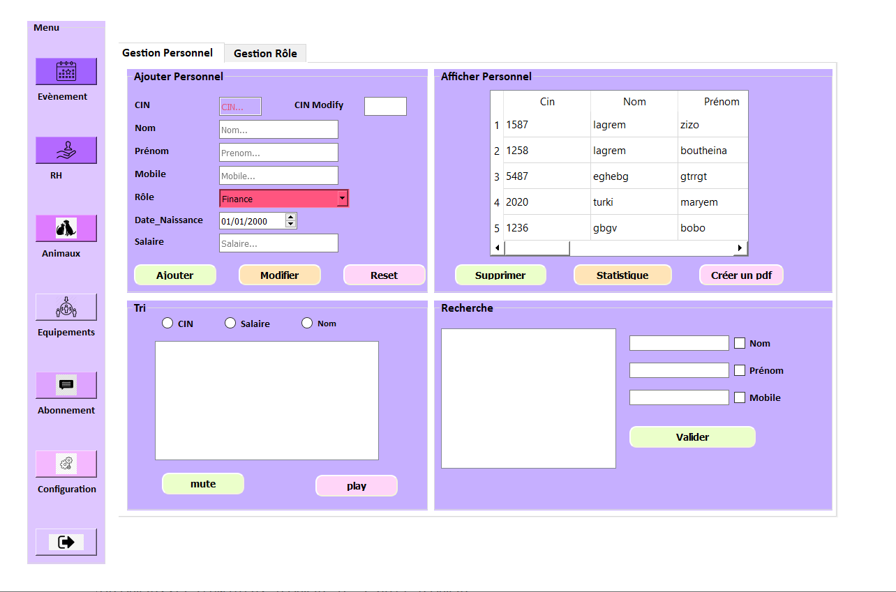
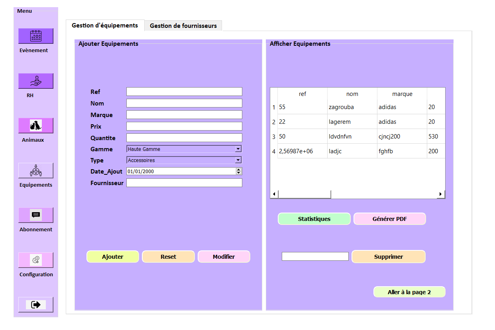
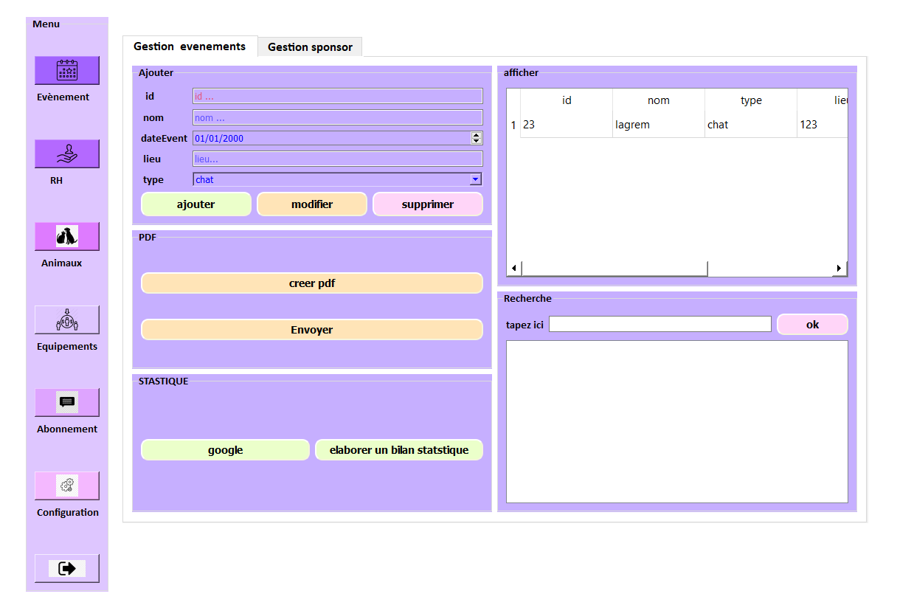
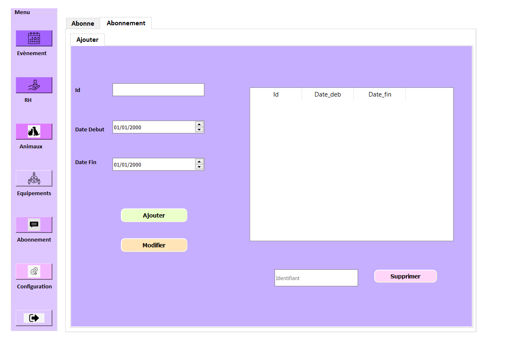
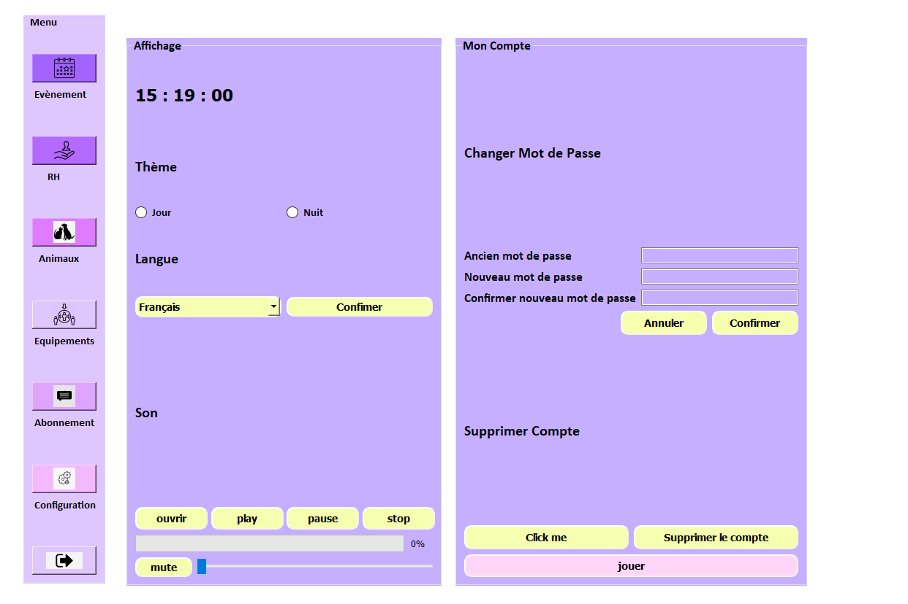

# 🐾 Pet Paradise

Ce projet a été réalisé dans le cadre d’un projet académique en équipe. Il s'agit d'une application **desktop** développée avec **C** et **Qt** pour la gestion des adoptions d’animaux et des produits liés aux animaux.

---

## 🎯 Objectifs du Projet
- Créer une plateforme **desktop** intuitive pour la gestion des adoptions d’animaux
- Développer des modules pour la gestion des animaux, des produits pour animaux, et des adoptions
- Permettre aux utilisateurs de gérer les profils des animaux, les stocks de produits et les demandes d’adoption

---

## 🧠 Mon Rôle dans le Projet
- Développement de l’interface utilisateur avec **Qt** pour créer une expérience fluide sur desktop
- Création des modules de gestion des animaux et des produits animaux
- Implémentation de la base de données **MySQL** pour gérer les informations relatives aux animaux, aux produits et aux adoptions
- Gestion de l’interaction entre l’interface graphique et la base de données à travers les requêtes SQL

---

## 🛠️ Technologies utilisées
- **Langage de programmation** : C
- **Plateforme** : Qt (pour le développement de l’interface desktop)
- **Base de données** : MySQL
- **Outils de gestion** : Git, GitHub, Trello

---

## 👥 Équipe
Ce projet a été réalisé en collaboration avec 3 autres membres de l’équipe. Mon rôle principal a été orienté vers le développement des modules backend (gestion des animaux et des produits), ainsi que l’architecture de la base de données.

---

## 💡 Fonctionnalités
- **Gestion des animaux** : Ajout, modification et suppression des profils d'animaux disponibles à l'adoption.
- **Gestion des produits pour animaux** : Suivi des stocks et ajout de nouveaux produits.
- **Gestion des adoptions** : Suivi des demandes d'adoption, validation des candidatures et gestion du processus.
- **Interface utilisateur** : Interface graphique simple et efficace, construite avec Qt pour une utilisation fluide sur les plateformes desktop.
- **Module RH** : Gestion des employés, suivi des horaires et des tâches des responsables des adoptions et des animaux.
- **Gestion de la nourriture** : Suivi des stocks de nourriture pour animaux, gestion des achats et des fournisseurs.
- **Gestion des équipements** : Gestion des équipements nécessaires au bon fonctionnement de la structure, tels que les cages, jouets, et autres matériels.
- **Abonnement** : Gestion des abonnements des utilisateurs (pour l’adoption, produits, services) et suivi des paiements récurrents.
- **Événements** : Création et gestion d’événements pour promouvoir les adoptions ou organiser des activités avec les animaux (ex : journées portes ouvertes, événements caritatifs).
- **Paramètres** : Gestion des paramètres de l’application (personnalisation de l'interface, gestion des utilisateurs et des rôles).
- **Module de jeux** : Ajout de mini-jeux (comme des puzzles) pour divertir les utilisateurs pendant leur navigation sur la plateforme et promouvoir l'engagement.

## 📸 Screenshots

Voici quelques captures d'écran de l'interface de l'application :

