# 🎓 Projet de Fin d'Études – Plateforme de Recrutement (We Tekup)

Ce projet a été réalisé dans le cadre de mon stage de fin d’études au sein de l’entreprise **We Tekup**.  
Il s'agit d'une **plateforme complète de gestion du processus de recrutement**, visant à faciliter la publication d’offres, le suivi des candidatures, la communication entre recruteurs et candidats, ainsi que la gestion des événements de recrutement.

---

## ⚙️ Stack Technique

- **Frontend :** React.js (avec Redux, Axios, Chart.js)
- **Backend :** Django + Django REST Framework
- **Base de données :** PostgreSQL
- **Websockets :** Django Channels (pour le chat temps réel)
- **Authentification :** JWT Tokens
- **Mailing :** SMTP + envoi automatique de mails
- **Génération de rapports :** PDF export (WeasyPrint)

---

## ✨ Fonctionnalités principales

### 🔐 Authentification & Rôles
- Inscription et connexion pour les candidats, recruteurs et administrateurs
- Attribution dynamique des rôles et redirections vers les espaces dédiés

### 📝 Gestion des Offres d’Emploi
- Création d’offres par les recruteurs
- Validation des offres par l’administrateur
- Affichage public des offres validées

### 🎯 Espace Candidat
- Navigation et filtrage des offres
- Postulation + ajout aux favoris
- Suivi des candidatures (statut, date, recherche)
- Accès aux détails de chaque entreprise
- Historique des candidatures
- Système de messagerie intégré (chat + notifications en temps réel)

### 🧑‍💼 Espace Recruteur
- Dashboard interactif avec :
  - Statistiques des candidatures
  - Graphes (nombre d'applications, répartition des statuts, etc.)
  - Génération de rapports PDF
- Accès aux candidatures reçues par emploi
- Détail des profils candidats (CV, contact WhatsApp, email, etc.)
- Intégration du chat pour planification d'entretiens
- Actions : accepter/refuser la candidature + envoi automatique de mail

### 🗓️ Module Événements
- Création et gestion d’événements de recrutement
- Recherche par secteur/région
- Intégration de Google Forms pour inscriptions
- Droits spécifiques : admin peut archiver, modifier ou supprimer

### 📩 Réclamations
- Formulaire de réclamation pour les utilisateurs
- Traitement back-office par l’administrateur
- Mise à jour du statut + génération de rapports PDF
- Visualisation temps réel côté recruteur

### 📊 KPI & Statistiques Globales
- Nombre d’utilisateurs inscrits
- Volume des candidatures par période
- Offres publiées par mois
- Taux d’acceptation global des candidatures

---

## 💼 Objectifs et Apports

Ce projet m’a permis de :
- Mettre en pratique mes compétences full-stack dans un contexte professionnel réel
- Concevoir une architecture modulaire et évolutive
- Implémenter un système de messagerie temps réel avec Websockets
- Gérer une base de données relationnelle complexe
- Offrir une expérience utilisateur fluide et réactive

---

---

---

## 🖼️ Interfaces

Cette section présente quelques captures d’écran illustrant les principales interfaces de la plateforme :

| Interface | Aperçu |
|----------|--------|
| 🏠 Page d’Accueil | 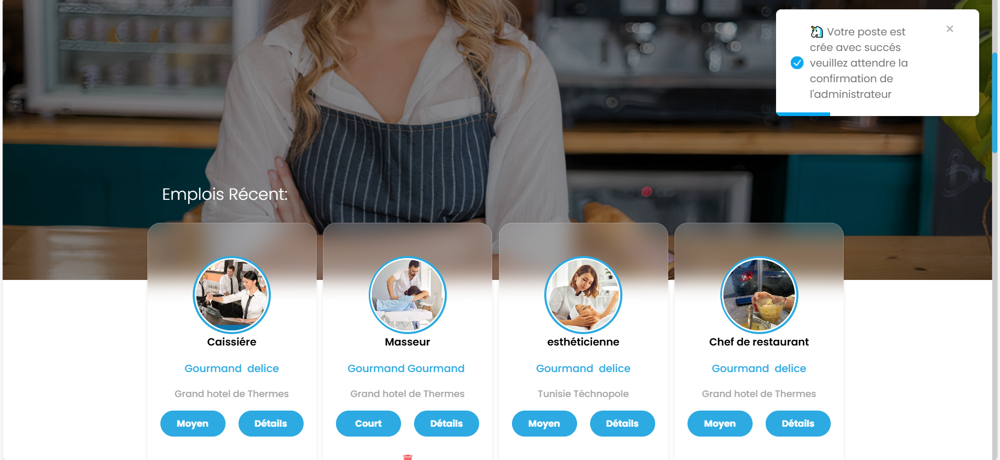 |
| 📊 Dashboard Recruteur | 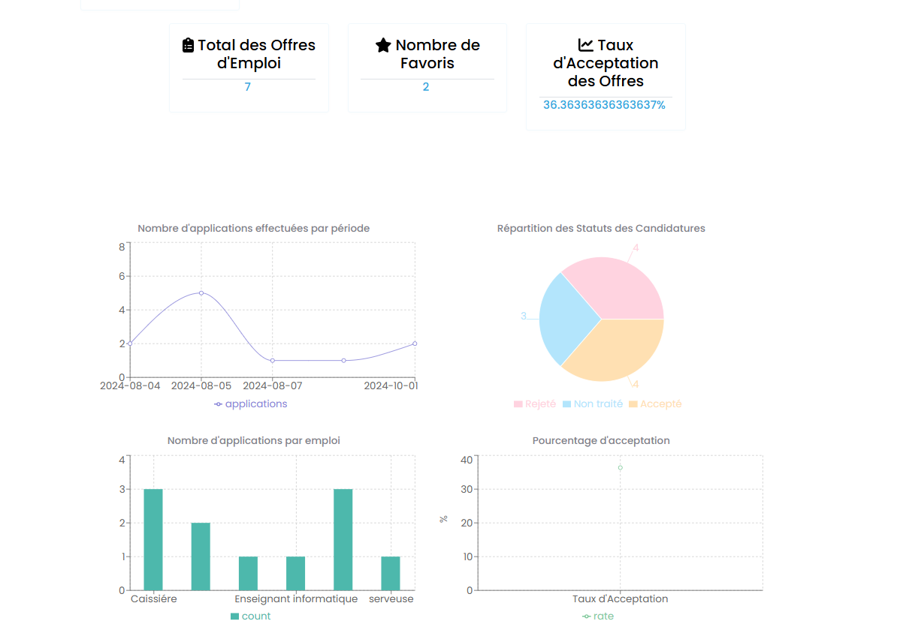 |
| 📝 Ajout d’une Offre | 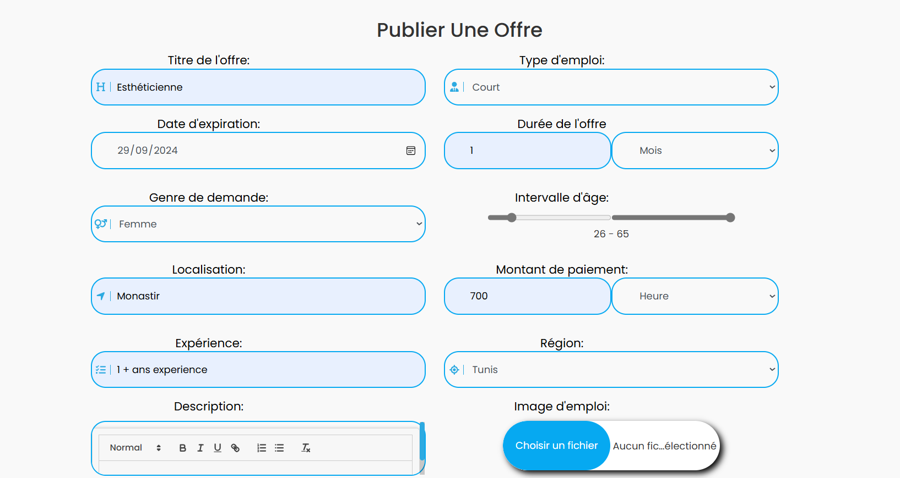 |
| 📥 Candidatures | 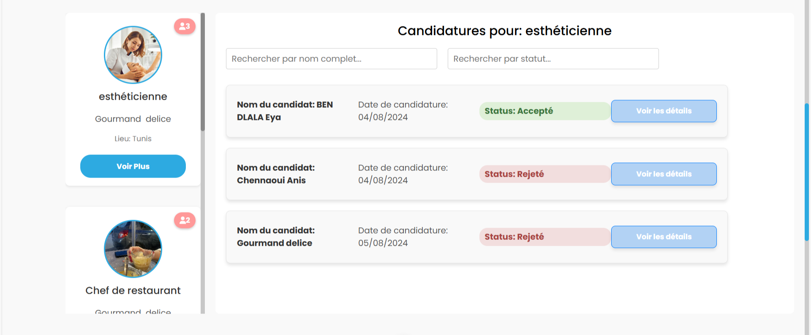 |
| 👤 Détails Candidat | 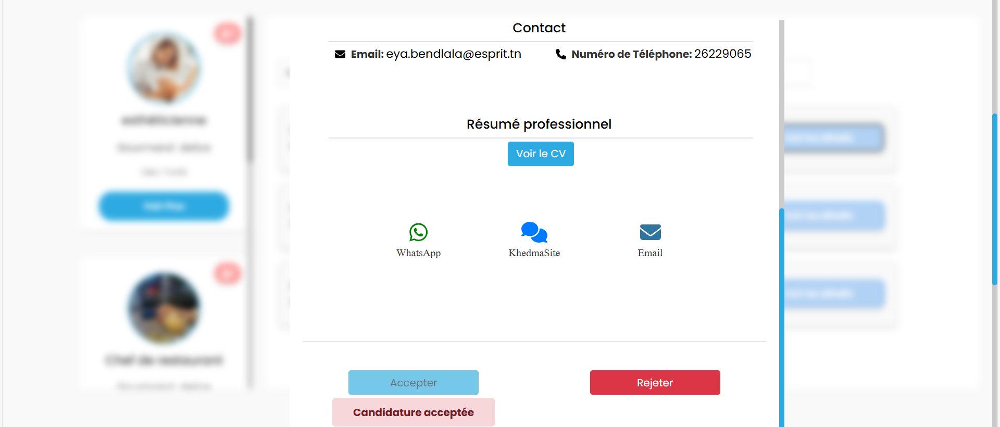 |
| 💬 Système de Chat | 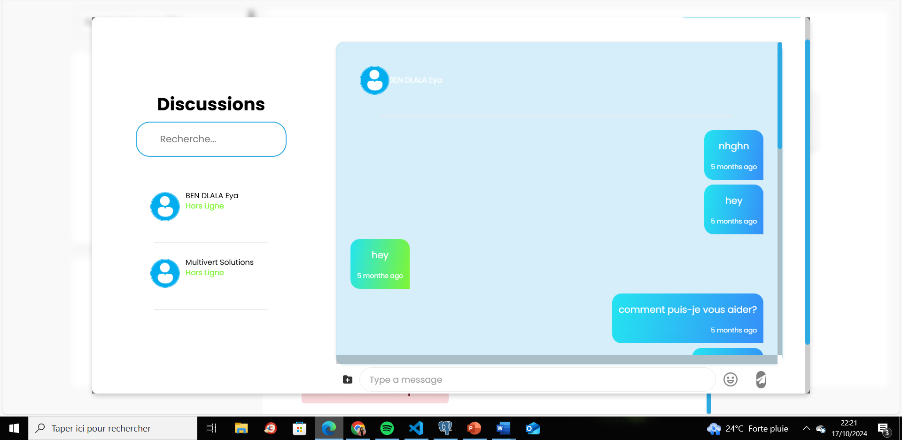 |
| 🧠 Backoffice Emploi (Admin) | 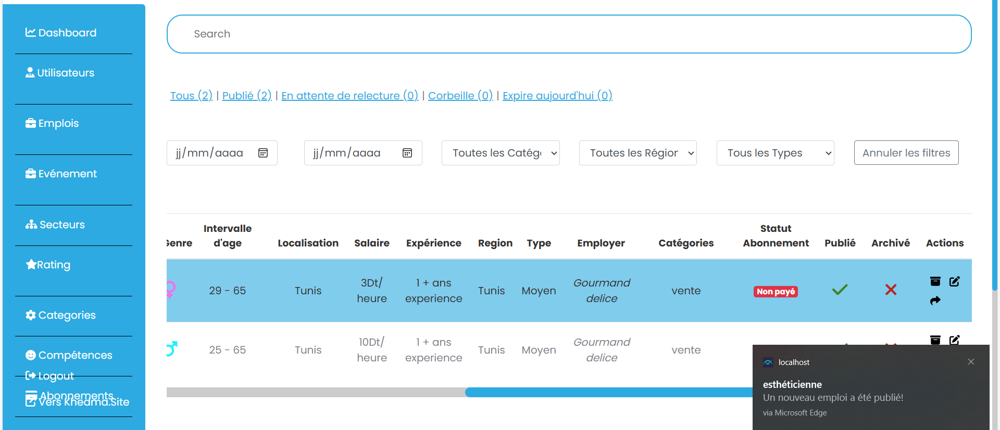 |
| 📈 Dashboard Global | 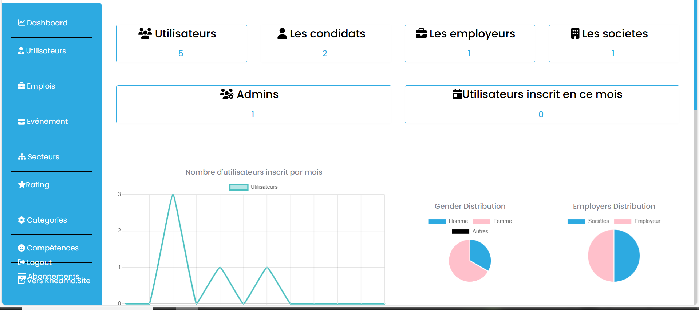 |
| 💬 Discussion Temps Réel |  |
| 📨 Réclamations Utilisateur | 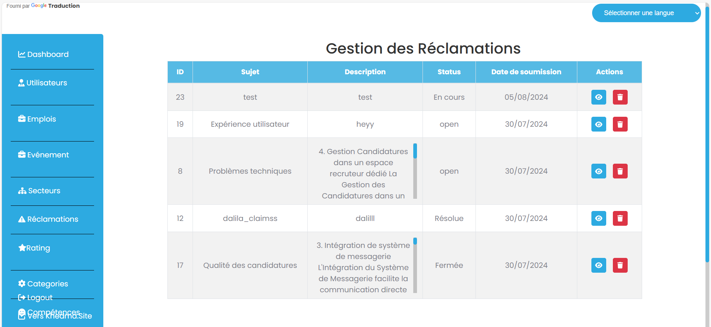 |
| 📅 Liste des Événements | 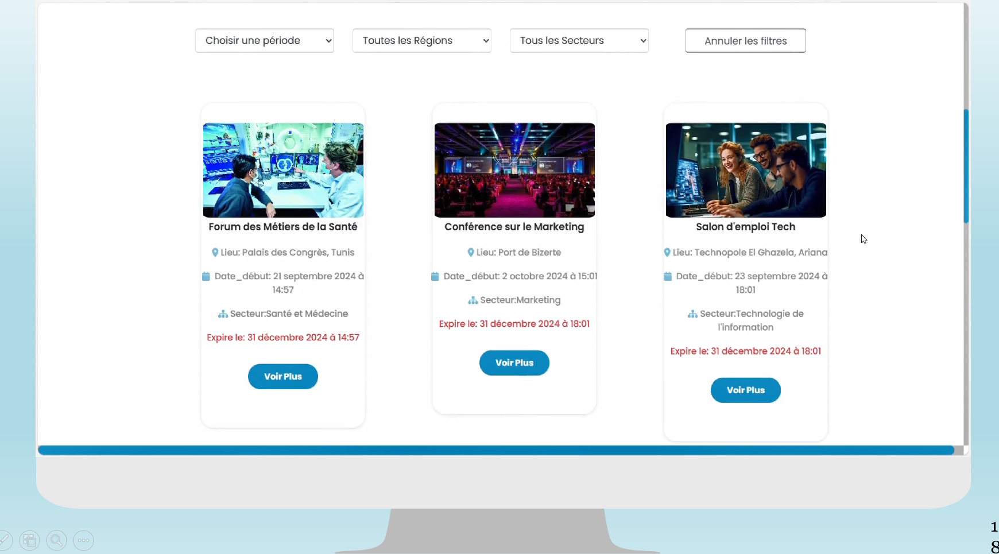 |
| 🛠️ Backoffice Événements (Admin) | 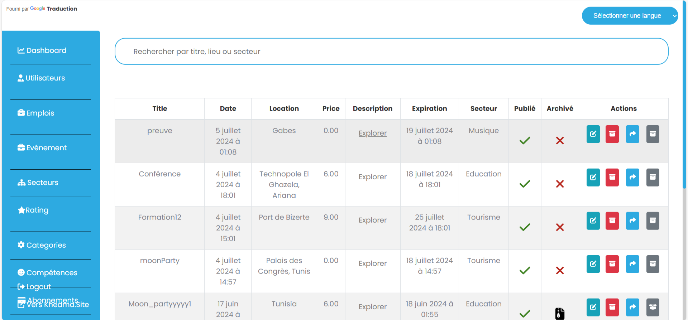 |
| ⭐ Favoris  | 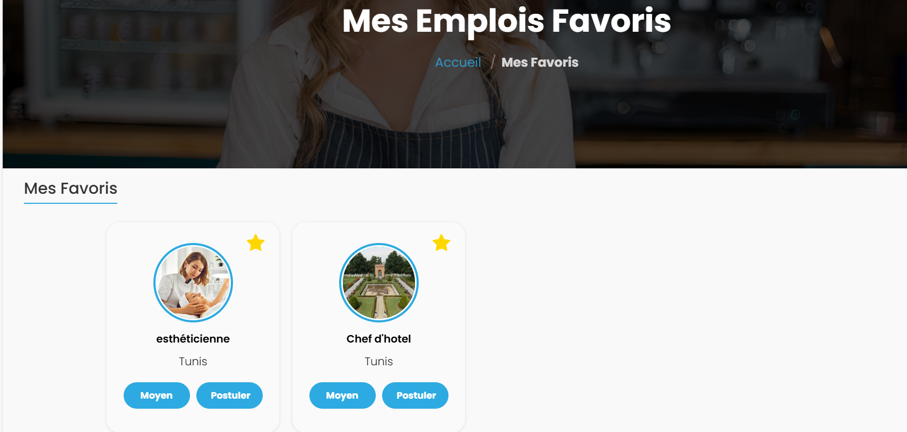 |

