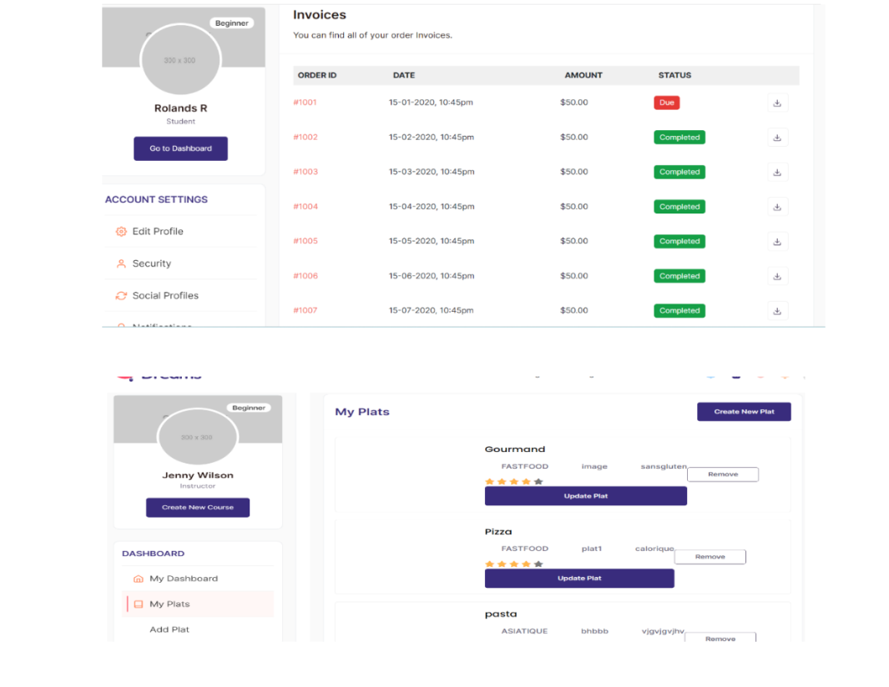
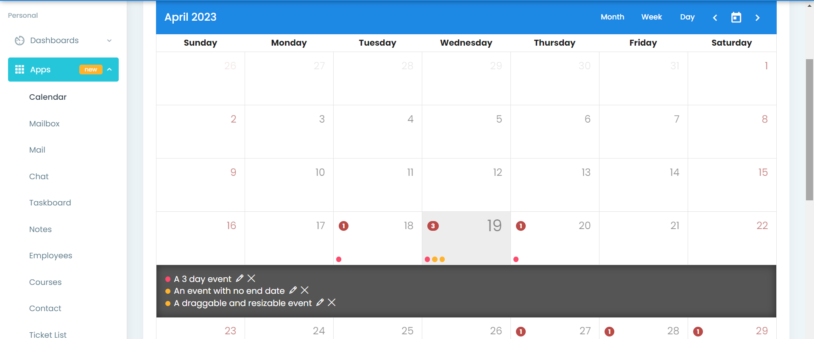
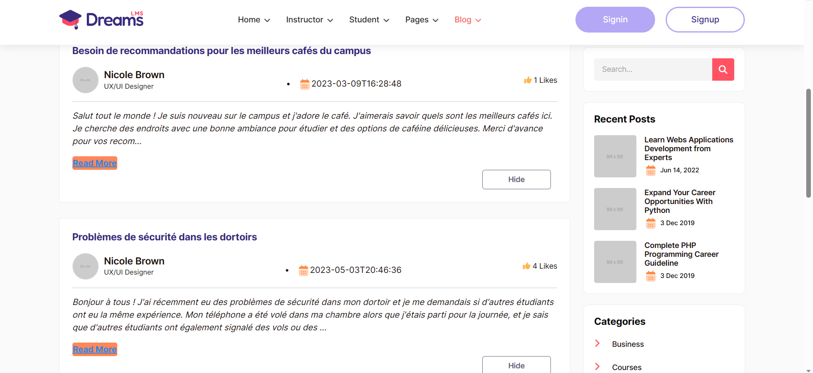
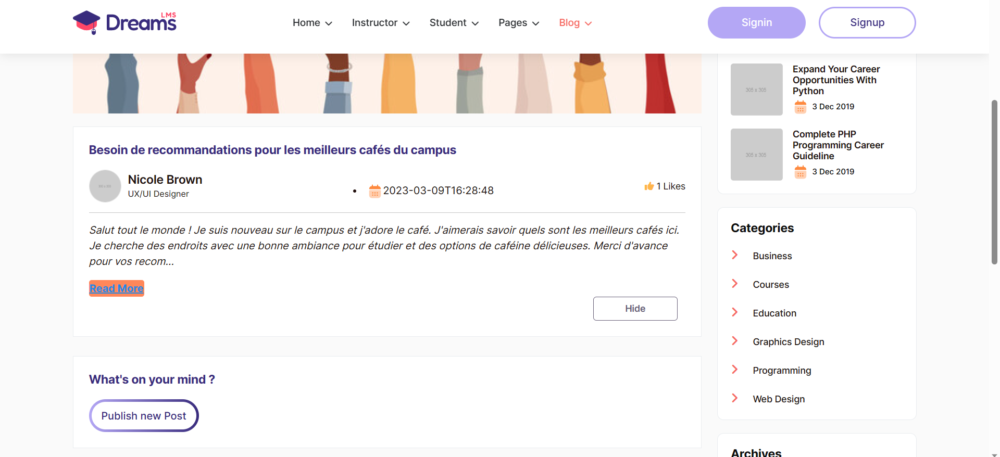
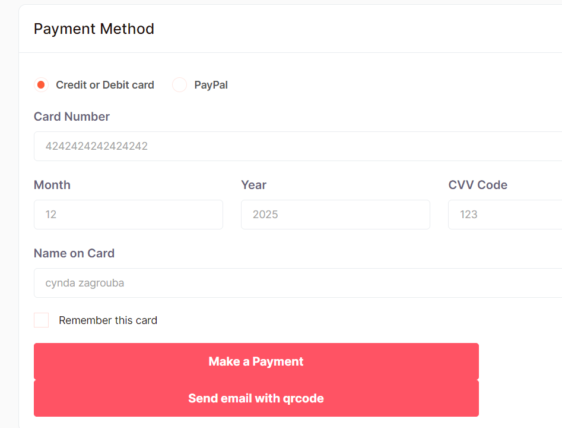

# CampusConnect
# 🎓 Campus – Restaurant & Housing Management System

Un projet complet de gestion des foyers universitaires, centralisant plusieurs modules essentiels pour la vie étudiante : restauration, hébergement, événements, forum, et réclamations.

---

## ⚙️ Fonctionnalités principales

### 🍽️ Module Restauration
- Consultation des **menus quotidiens**
- Réservation des repas
- Gestion des menus et stocks côté administration

### 🛏️ Module Hébergement
- Attribution et gestion des **chambres**
- Suivi des disponibilités
- Historique et demandes de changement

### 📅 Module Événements
- Création et affichage via un **calendrier dynamique**
- Gestion des participations

### 💬 Forum
- Création de sujets
- Réponses, likes et modération

### 🛠️ Réclamations
- Envoi de réclamations par les utilisateurs
- Suivi de traitement
- Réponses administratives

---

## 🧱 Stack Technique

- **Frontend** : Angular
- **Backend** : Spring Boot
- **Base de données** : (MySQL)
- **Librairies utilisées** :
  - FullCalendar (événements)
  - Bootstrap / Angular Material (UI)
  - Etc.

---

## 🖼️ Interfaces

| Fonction | Capture |
|---------|---------|
| Acceuil |  |
| Menu restauration |  |
| Calendrier événements |  |
| Forum1 |  |
| Forum2 |  |
| Paiement |  |

➡️ *Plus de captures disponibles dans le dossier [`images`](./images)*

---

## 🚀 Lancer le projet en local

```bash
# Backend Spring Boot
cd backend
./mvnw spring-boot:run

# Frontend Angular
cd frontend
npm install
ng serve
