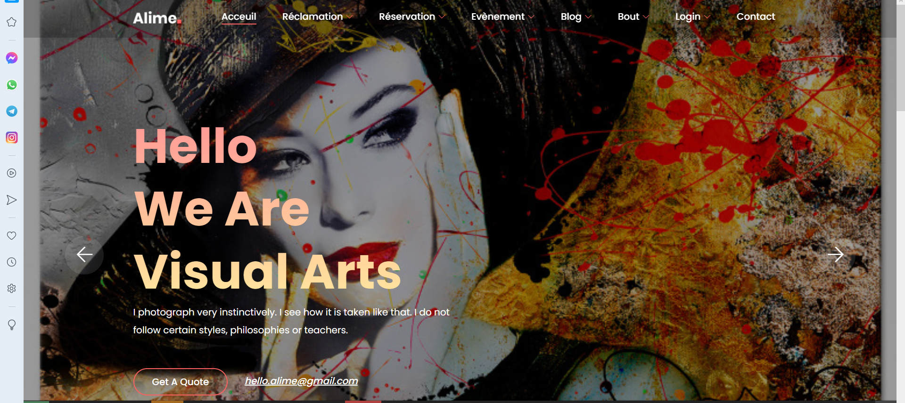
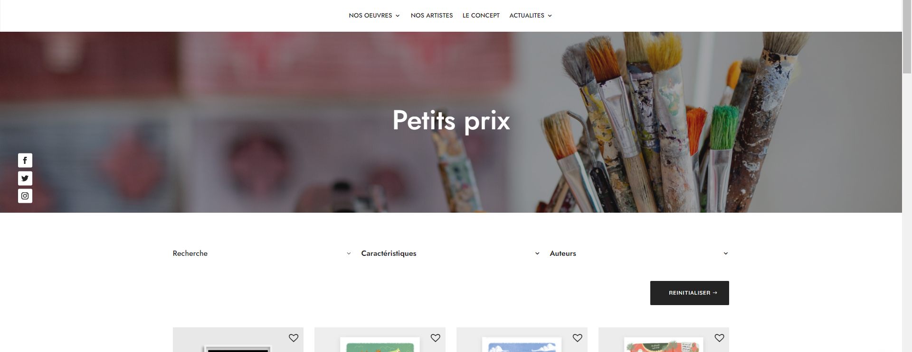

# 🎨 Gallerie-d'art

**Gallerie-d'art** est une plateforme artistique complète, développée pour le web et le desktop, permettant la découverte, l'achat et la gestion d'œuvres d'art. Ce projet a été réalisé dans le cadre d’un projet académique, mettant en œuvre une architecture logicielle moderne basée sur Symfony et JavaFX.

---
📚 Objectifs du Projet
Appliquer une architecture logicielle MVC complète (Symfony & JavaFX)

Concevoir une plateforme multi-modules (auth, gestion produit, réclamations)

Intégrer la base de données avec Doctrine et JDBC

Créer une interface intuitive pour deux environnements différents
## 🛠️ Technologies Utilisées

- **Web (Backend + Frontend)** : Symfony (PHP Framework)
- **Desktop** : JavaFX (Java)
- **Base de données** : MySQL
- **Gestion des utilisateurs** : Sessions PHP / Sécurité Symfony
- **Autres** : Twig, Doctrine ORM, JavaFX Scene Builder

---

## 🧩 Modules Développés

### 🔐 Authentification
- Inscription et connexion sécurisée
- Gestion des rôles : Utilisateur, Administrateur, Artiste
- Protection des routes et données sensibles

### 📝 Module Formulaire
- Formulaires pour l'ajout ou la soumission d'œuvres
- Validation côté client et serveur

### 🛍️ Module Produits
- Catalogue d'œuvres disponibles à la vente
- Détails des produits et ajout au panier
- Processus de commande simulé

### 📨 Module Réclamations
- Interface utilisateur pour déposer une réclamation
- Traitement des réclamations par l’administrateur
- Historique des réclamations consultable

---

## 💻 Plateformes Supportées

- 🌐 **Web** : Application développée avec Symfony, accessible via navigateur
- 🖥️ **Desktop** : Application JavaFX pour gestion locale et affichage interactif

---

## 📸 Screenshots

Voici quelques captures d'écran de l'interface de l'application :





## 🔧 Installation & Exécution

### 🌐 Application Web (Symfony)

```bash
# Cloner le projet
git clone https://github.com/eyabendlala/gallerie-d-art.git
cd gallerie-d-art/web

# Installer les dépendances
composer install

# Configurer la base de données
cp .env .env.local
# Modifier les paramètres DB_URL dans .env.local

php bin/console doctrine:database:create
php bin/console doctrine:migrations:migrate
php bin/console server:run
